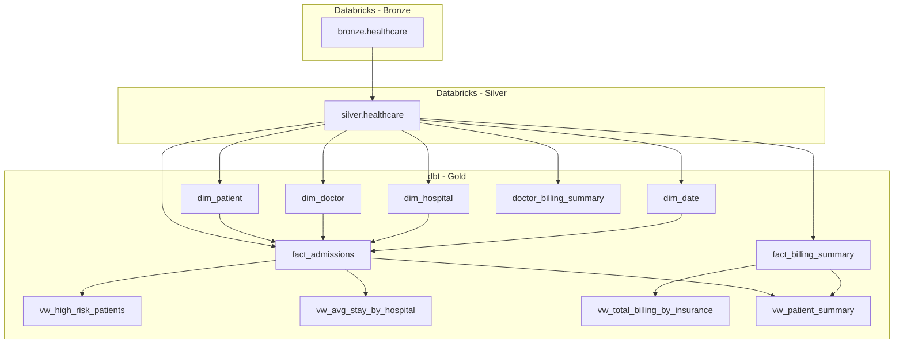

# 🏥 Patient Risk Prediction — End-to-End Analytics Project

**Author:** Suleman Ali  
**Date:** 2025-10-28  

---

## 📘 Table of Contents
1. [Project Overview](#project-overview)  
2. [Architecture & Data Flow](#architecture--data-flow)  
3. [Data Lineage](#data-lineage)  
4. [Conceptual Mapping to Clinical Tables](#conceptual-mapping-to-clinical-tables)  
5. [Gold Layer Models](#gold-layer-models)  
6. [ETL Summary](#etl-summary)  
7. [Power BI Analytics & Visualization](#power-bi-analytics--visualization)  
8. [Next Steps (Planned)](#next-steps-planned)  
9. [Notes](#notes)  

---

## 🧩 Project Overview

This project implements a complete **data engineering and analytics solution** for patient risk prediction using the [Healthcare Dataset](https://www.kaggle.com/datasets/prasad22/healthcare-dataset).

### Goals:
- Clean and model healthcare data (Patients, Diagnoses, Treatments, Outcomes)  
- Build ETL pipelines using **Databricks + dbt**  
- Design an **interactive Power BI dashboard** for hospital analytics  
- Extend with predictive modeling and Gen-AI chatbot  

---

## 🧱 Architecture & Data Flow

| Layer | Platform | Description |
|--------|-----------|-------------|
| **Bronze** | Databricks | Raw ingestion of healthcare dataset |
| **Silver** | Databricks | Data cleaning, encoding, and transformation |
| **Gold** | dbt + Databricks | Dimensional modeling for Power BI consumption |
| **BI** | Power BI | Dashboards for operational and clinical analytics |

---

## 🧭 Data Lineage



---

## 🧠 Conceptual Mapping to Clinical Tables

| Conceptual Table | Implemented In | Description |
|------------------|----------------|-------------|
| **Patients** | `dim_patient`, `vw_patient_summary` | Patient demographics, insurance, identifiers |
| **Diagnoses** | `vw_high_risk_patients` | Diagnosis and risk assessment |
| **Treatments** | `vw_patient_summary` | Admission, doctor, and treatment information |
| **Outcomes** | `vw_high_risk_patients`, `fact_billing_summary` | Stay duration, discharge, billing, and outcomes |

---

## 🧱 Gold Layer Models

| Type | Model | Description |
|-------|--------|-------------|
| **Dimension** | `dim_patient` | Patient demographics |
| **Dimension** | `dim_doctor` | Doctor details |
| **Dimension** | `dim_hospital` | Hospital metadata |
| **Dimension** | `dim_date` | Calendar attributes |
| **Fact** | `fact_admissions` | Admissions and stay data |
| **Fact** | `fact_billing_summary` | Hospital billing metrics |
| **Fact** | `doctor_billing_summary` | Doctor-level billing & admissions |
| **View** | `vw_high_risk_patients` | Risk classification view |
| **View** | `vw_avg_stay_by_hospital` | Avg stay by hospital |
| **View** | `vw_total_billing_by_insurance` | Billing by insurer |
| **View** | `vw_patient_summary` | Consolidated patient-level data |

---

## ⚙️ ETL Summary

| Step | Task | Tools |
|-------|------|-------|
| **1. Data Ingestion** | Import raw CSV from Kaggle | Databricks (Bronze) |
| **2. Data Cleaning** | Handle nulls, format columns | PySpark (Silver) |
| **3. Data Modeling** | Star schema, fact/dim design | dbt (Gold) |
| **4. Data Validation** | Run dbt tests (unique, not_null, relationships) | dbt tests |
| **5. Analytics Layer** | Build dashboards | Power BI |

---

## 📊 Power BI Analytics & Visualization  

### 🎯 Dashboard Pages Overview  

| Page | Purpose | Key Visuals |
|------|----------|-------------|
| **Home (Summary KPIs)** | Executive overview | KPIs: Admissions, Billing, Avg Stay, Risk % |
| **Patient Insights** | Patient demographics | Age, Gender, Insurance, Risk by Group |
| **Hospital Performance** | Hospital-level metrics | Avg Stay, Risk %, Admissions Trend |
| **Doctor Insights** | Doctor performance | Avg Stay Weighted, Top Doctors, Billing Efficiency |
| **Billing & Insurance** | Financial analytics | Billing by Insurance, % Share, Monthly Trends |
| **Date Trends** | Time-based analysis | Admissions, Billing, Risk, Avg Stay Trends |

---

### 🖼️ Dashboard Previews  

#### 🏠 Home (Summary KPIs)


#### 👩‍⚕️ Patient Insights


#### 🏥 Hospital Performance


#### 👨‍⚕️ Doctor Insights


#### 💰 Billing & Insurance


#### 📅 Date Trends


---

### 🧮 Key DAX Measures

```DAX
Total Admissions = SUM(fact_admissions[total_admissions])
Total Billing = SUM(fact_billing_summary[billing_amount])
Avg Stay Duration = AVERAGE(fact_admissions[avg_stay_duration])
% High-Risk Patients = 
DIVIDE(
    CALCULATE(COUNTROWS(vw_high_risk_patients), vw_high_risk_patients[risk_level] = "High"),
    COUNTROWS(vw_high_risk_patients),
    0
)
% Billing Share by Insurance =
DIVIDE(
    [Total Billing],
    CALCULATE([Total Billing], ALL(vw_total_billing_by_insurance)),
    0
)
```

---

## 🎨 Design Highlights

- Unified dark-light theme with gradient cards  
- Consistent slicers (Year, Month, Hospital, Insurance)  
- Drill-through navigation to **Patient Details**  
- KPI indicators with dynamic icons and color states  

---

## 🔮 Next Steps

1. Add ML model (readmission prediction, stay duration regression).  
2. Integrate chatbot (natural language analytics). 

---

## 🧾 Notes
- Surrogate keys (`_sk`) generated via deterministic MD5 hashing.  
- dbt tests: `unique`, `not_null`, `relationships` enforced.  
- Relationships structured in a **star schema** for optimal Power BI performance.  

---

### 📂 Repository Structure

```
├── chatbot/
├── databricks/
│   ├── bronze/
│   ├── silver/
│   └── gold/
├── dbt/
│   ├── analyses/
│   ├── macros/
│   ├── models/
│   ├── seeds/
│   ├── snapshots/
│   ├── tests/
│   └── dbt_project.yml
├── powerbi/
│   ├── Patient_Risk_Prediction.pbix
│   └── assets/
│       ├── home_summary.png
│       ├── patient_insights.png
│       ├── hospital_performance.png
│       ├── doctor_insights.png
│       ├── billing_insurance.png
│       └── date_trends.png
└── README.md
```
