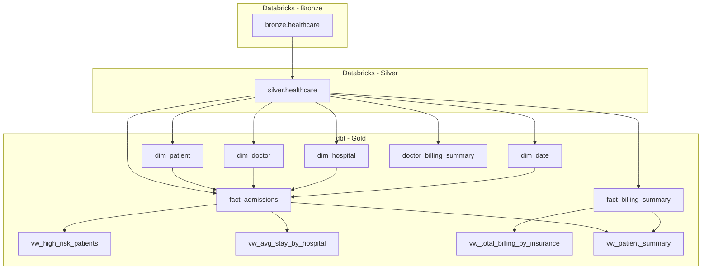
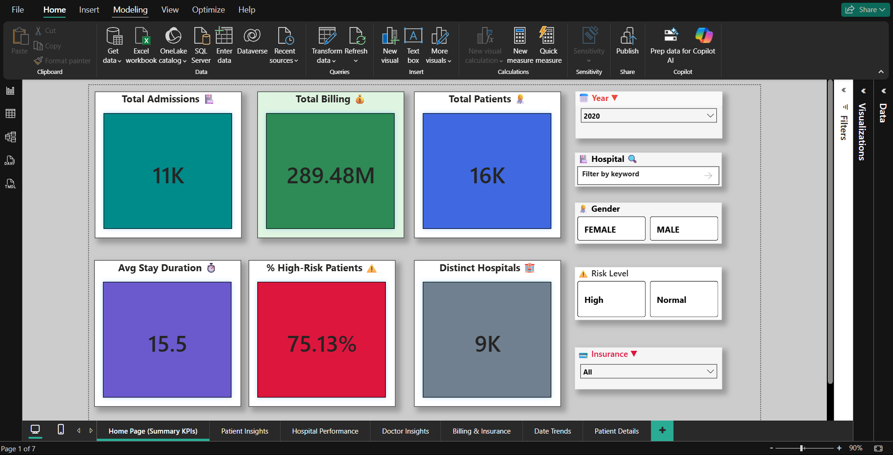
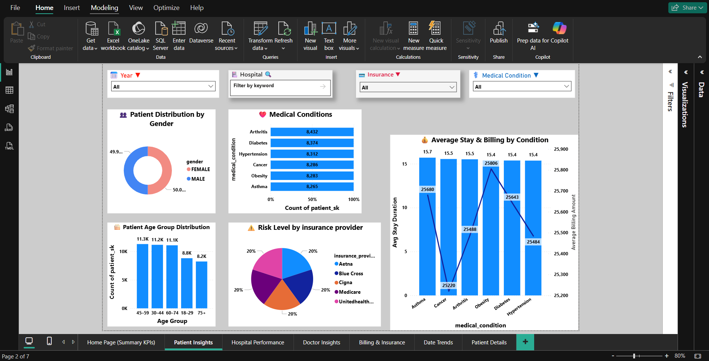
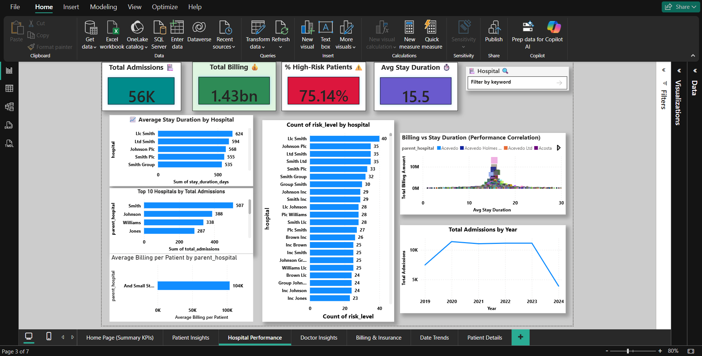
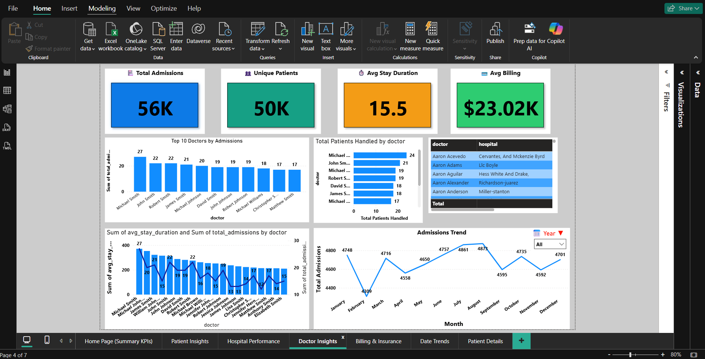
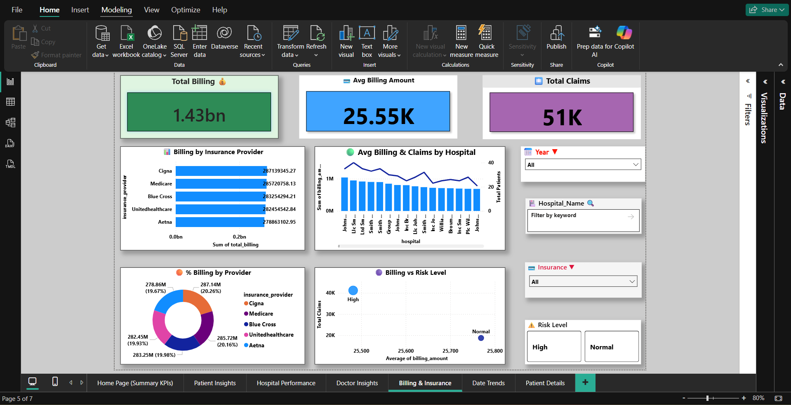
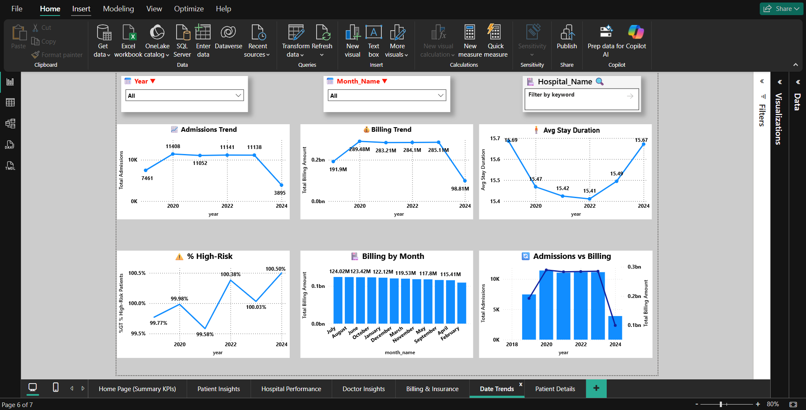
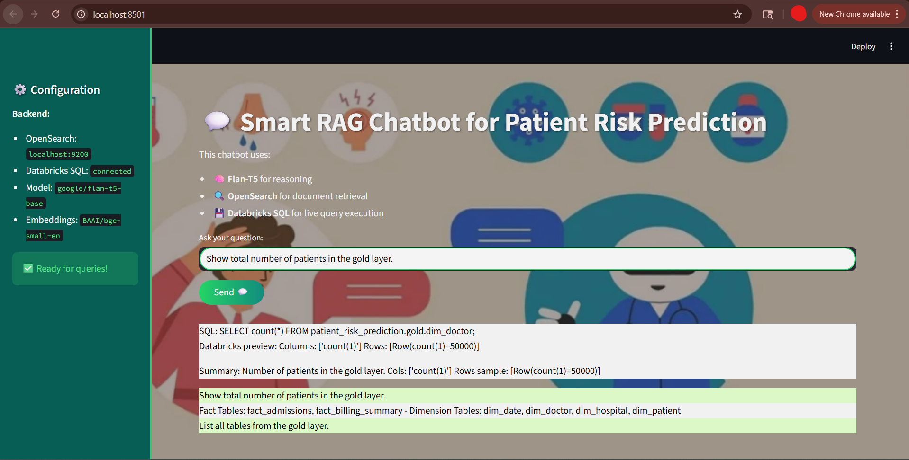

# 🏥 Patient Risk Prediction — End-to-End Analytics Project

**Author:** Suleman Ali  
**Date:** 2025-10-28  

---

## 📘 Table of Contents
1. [Project Overview](#project-overview)  
2. [Architecture & Data Flow](#architecture--data-flow)  
3. [Data Lineage](#data-lineage)  
4. [Conceptual Mapping to Clinical Tables](#conceptual-mapping-to-clinical-tables)  
5. [Gold Layer Models](#gold-layer-models)  
6. [ETL Summary](#etl-summary)  
7. [Power BI Analytics & Visualization](#power-bi-analytics--visualization)
8. [Machine Learning Models](#machine-learning-models)
9. [Smart RAG Chatbot — GenAI-Powered Data Assistant](#smart-rag-chatbot—genai-powered-data-assistant)  
10. [Notes](#notes)  

---

## 🧩 Project Overview

This project implements a complete **data engineering and analytics solution** for patient risk prediction using the [Healthcare Dataset](https://www.kaggle.com/datasets/prasad22/healthcare-dataset).

### Goals:
- Clean and model healthcare data (Patients, Diagnoses, Treatments, Outcomes)  
- Build ETL pipelines using **Databricks + dbt**  
- Design an **interactive Power BI dashboard** for hospital analytics  
- Extend with predictive modeling and Gen-AI chatbot  

---

## 🧱 Architecture & Data Flow

| Layer | Platform | Description |
|--------|-----------|-------------|
| **Bronze** | Databricks | Raw ingestion of healthcare dataset |
| **Silver** | Databricks | Data cleaning, encoding, and transformation |
| **Gold** | dbt + Databricks | Dimensional modeling for Power BI consumption |
| **BI** | Power BI | Dashboards for operational and clinical analytics |

---

## 🧭 Data Lineage



---

## 🧠 Conceptual Mapping to Clinical Tables

| Conceptual Table | Implemented In | Description |
|------------------|----------------|-------------|
| **Patients** | `dim_patient`, `vw_patient_summary` | Patient demographics, insurance, identifiers |
| **Diagnoses** | `vw_high_risk_patients` | Diagnosis and risk assessment |
| **Treatments** | `vw_patient_summary` | Admission, doctor, and treatment information |
| **Outcomes** | `vw_high_risk_patients`, `fact_billing_summary` | Stay duration, discharge, billing, and outcomes |

---

## 🧱 Gold Layer Models

| Type | Model | Description |
|-------|--------|-------------|
| **Dimension** | `dim_patient` | Patient demographics |
| **Dimension** | `dim_doctor` | Doctor details |
| **Dimension** | `dim_hospital` | Hospital metadata |
| **Dimension** | `dim_date` | Calendar attributes |
| **Fact** | `fact_admissions` | Admissions and stay data |
| **Fact** | `fact_billing_summary` | Hospital billing metrics |
| **Fact** | `doctor_billing_summary` | Doctor-level billing & admissions |
| **View** | `vw_high_risk_patients` | Risk classification view |
| **View** | `vw_avg_stay_by_hospital` | Avg stay by hospital |
| **View** | `vw_total_billing_by_insurance` | Billing by insurer |
| **View** | `vw_patient_summary` | Consolidated patient-level data |

---

## ⚙️ ETL Summary

| Step | Task | Tools |
|-------|------|-------|
| **1. Data Ingestion** | Import raw CSV from Kaggle | Databricks (Bronze) |
| **2. Data Cleaning** | Handle nulls, format columns | PySpark (Silver) |
| **3. Data Modeling** | Star schema, fact/dim design | dbt (Gold) |
| **4. Data Validation** | Run dbt tests (unique, not_null, relationships) | dbt tests |
| **5. Analytics Layer** | Build dashboards | Power BI |

---

## 📊 Power BI Analytics & Visualization  

### 🎯 Dashboard Pages Overview  

| Page | Purpose | Key Visuals |
|------|----------|-------------|
| **Home (Summary KPIs)** | Executive overview | KPIs: Admissions, Billing, Avg Stay, Risk % |
| **Patient Insights** | Patient demographics | Age, Gender, Insurance, Risk by Group |
| **Hospital Performance** | Hospital-level metrics | Avg Stay, Risk %, Admissions Trend |
| **Doctor Insights** | Doctor performance | Avg Stay Weighted, Top Doctors, Billing Efficiency |
| **Billing & Insurance** | Financial analytics | Billing by Insurance, % Share, Monthly Trends |
| **Date Trends** | Time-based analysis | Admissions, Billing, Risk, Avg Stay Trends |

---

### 🖼️ Dashboard Previews  

#### 🏠 Home (Summary KPIs)


#### 👩‍⚕️ Patient Insights


#### 🏥 Hospital Performance


#### 👨‍⚕️ Doctor Insights


#### 💰 Billing & Insurance


#### 📅 Date Trends


---

### 🧮 Key DAX Measures

```DAX
Total Admissions = SUM(fact_admissions[total_admissions])
Total Billing = SUM(fact_billing_summary[billing_amount])
Avg Stay Duration = AVERAGE(fact_admissions[avg_stay_duration])
% High-Risk Patients = 
DIVIDE(
    CALCULATE(COUNTROWS(vw_high_risk_patients), vw_high_risk_patients[risk_level] = "High"),
    COUNTROWS(vw_high_risk_patients),
    0
)
% Billing Share by Insurance =
DIVIDE(
    [Total Billing],
    CALCULATE([Total Billing], ALL(vw_total_billing_by_insurance)),
    0
)
```
---

## 🎨 Design Highlights

- Unified dark-light theme with gradient cards  
- Consistent slicers (Year, Month, Hospital, Insurance)  
- Drill-through navigation to **Patient Details**  
- KPI indicators with dynamic icons and color states 

---
### 🤖 Machine Learning Models
## 🎯 Objective

- Two predictive models were developed using Delta tables as inputs:
- Classification Model → Predict whether a patient will be readmitted within 30 days
- Regression Model → Predict the expected hospital stay duration (in days)

⚙️ Workflow
| Step                  | Task                                                                        | Tools              |
| --------------------- | --------------------------------------------------------------------------- | ------------------ |
| **1. Data Source**    | Delta tables from `ml.patient_readmission_30d` and `ml.stay_duration`       | Databricks SQL     |
| **2. Data Prep**      | Encoding, scaling, and feature selection                                    | scikit-learn       |
| **3. Model Training** | Logistic Regression (classification) and Linear Regression (regression)     | sklearn            |
| **4. Evaluation**     | Precision, Recall, F1, ROC-AUC (classification); MAE, RMSE, R² (regression) | sklearn.metrics    |
| **5. Visualization**  | Compare before & after scaled datasets and actual vs predicted outputs      | pandas, matplotlib |
---

🧮 Classification — Readmission Prediction (30 Days)
```
# Logistic Regression Model
model = LogisticRegression()
model.fit(X_train_scaled, y_train)

preds = model.predict(X_test_scaled)
print(classification_report(y_test, preds))
print("ROC-AUC:", roc_auc_score(y_test, preds))
```

# Key Metrics:
- Accuracy: ~0.99
- ROC-AUC: 0.50 (imbalanced class — majority of patients not readmitted)
- Notes: Consider oversampling techniques (SMOTE) for better class balance

## 📈 Regression — Stay Duration Prediction
```
# Linear Regression Model
model = LinearRegression()
model.fit(X_train_scaled, y_train)

preds = model.predict(X_test_scaled)
mae = mean_absolute_error(y_test, preds)
mse = mean_squared_error(y_test, preds)
rmse = np.sqrt(mse)
r2 = r2_score(y_test, preds)
```

## Model Performance:

| Metric   | Description                  | Example Result |
| -------- | ---------------------------- | -------------- |
| **MAE**  | Mean Absolute Error          | 1.42           |
| **MSE**  | Mean Squared Error           | 3.84           |
| **RMSE** | Root Mean Square Error       | 1.96           |
| **R²**   | Coefficient of Determination | 0.87           |

## 📊 Example Visualization
| Actual Stay | Predicted Stay |
| ----------- | -------------- |
| 14          | 13.8           |
| 22          | 21.5           |
| 7           | 7.3            |
| 10          | 9.7            |

---
## 💡 Insights
- The regression model achieved strong correlation (R² ≈ 0.87).
- Classification model indicates need for data rebalancing or additional patient history features.
- Future versions will integrate model outputs into Power BI dashboards via Delta Live Tables.

---
### 🤖 Smart RAG Chatbot — GenAI-Powered Data Assistant

## 🎯 Objective

- The Smart RAG Chatbot extends the Patient Risk Prediction project with Natural Language Querying over clinical data.
- It combines Retrieval-Augmented Generation (RAG), Databricks SQL, and OpenSearch to enable interactive, context-aware analytics.

---
### 🧩 Architecture Overview

```
flowchart TD
    subgraph User["🧍 User"]
        Q["Natural Language Question"]
    end

    subgraph StreamlitApp["💬 Streamlit Chatbot UI"]
        A1["Question Input"]
        A2["Response Display"]
    end

    subgraph SmartRAG["🧠 Smart RAG Engine"]
        R1["SentenceTransformer (Embeddings)"]
        R2["OpenSearch Vector Store"]
        R3["Flan-T5 (Text Generation)"]
        R4["Databricks SQL Connector"]
    end

    Q --> A1 --> R1
    R1 --> R2
    R2 --> R3
    R3 --> R4
    R4 --> A2 --> Q

```
## ⚙️ Technology Stack
| Component           | Purpose                            | Tool / Model                                |
| ------------------- | ---------------------------------- | ------------------------------------------- |
| **Frontend**        | Chat Interface                     | Streamlit                                   |
| **Vector Store**    | Document retrieval                 | OpenSearch                                  |
| **Embedding Model** | Semantic search                    | `BAAI/bge-small-en`                         |
| **Text Generation** | Question answering                 | `google/flan-t5-base`                       |
| **SQL Connector**   | Analytical query execution         | Databricks SQL Connector                    |
| **RAG Controller**  | Context retrieval + response logic | Python (Smart_Rag_Databricks_Chatbot_V2.py) |

---
## 🧠 Workflow
| Step | Process                   | Description                                                                                                                |
| ---- | ------------------------- | -------------------------------------------------------------------------------------------------------------------------- |
| 1️⃣  | **Question Input**        | User enters a natural language query in Streamlit.                                                                         |
| 2️⃣  | **Embedding & Retrieval** | The query is embedded via `BAAI/bge-small-en` and matched against the OpenSearch vector index.                             |
| 3️⃣  | **Context Construction**  | Top `k` relevant documents are concatenated as context.                                                                    |
| 4️⃣  | **Answer Generation**     | `Flan-T5` model generates an answer using retrieved context.                                                               |
| 5️⃣  | **SQL Path (Analytical)** | If question involves aggregation or metrics, the chatbot generates SQL, executes it in Databricks, and summarizes results. |


---
## 🔮 Next Steps
1. Add ML model (readmission prediction, stay duration regression).
2. Integrate chatbot (natural language analytics).
3. Deploy ML models as REST APIs for Power BI integration.

---
## 🧾 Notes
- Surrogate keys (_sk) generated via deterministic MD5 hashing.
- dbt tests: unique, not_null, relationships enforced.
- Relationships structured in a star schema for optimal Power BI performance.

```
📂 Repository Structure
├── chatbot/
    ├── app/
           ├── app.py
           └── backround_pic_chatbot.png
    ├── notebooks/
            ├──  Smart_Rag_Databricks_Chatbot_V2.py
            ├── __init__.py
            └── notebooks/__init__.py
├── databricks/
│   ├── bronze/
│   ├── silver/
│   └── gold/
├── ml/
│   ├── patient_readmission_30d_notebook.ipynb
│   └── stay_duration_notebook.ipynb
├── dbt/
│   ├── models/
│   └── dbt_project.yml
├── powerbi/
│   ├── Patient_Risk_Prediction.pbix
│   └── assets/
│       ├── home_summary.png
│       ├── patient_insights.png
│       ├── hospital_performance.png
│       ├── doctor_insights.png
│       ├── billing_insurance.png
│       └── date_trends.png
└── README.md
```
