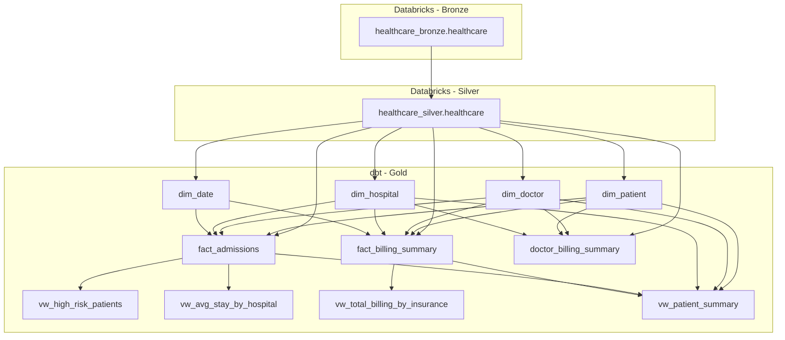

# Patient-Risk-Prediction

**Author:** Suleman Ali  
**Date:** 2025-10-28  

---

## Table of Contents
1. [Project Overview](#project-overview)
2. [Architecture & Data Flow](#architecture-&-data-flow)
3. [Data Lineage](#data-lineage)
4. [Conceptual Mapping to Clinical Tables](#conceptual-mapping-to-clinical-tables)
5. [Gold Layer Models](#gold-layer-models)
6. [ETL Summary](#etl-summary)
7. [Next Steps (Planned)](#next-steps-planned)
8. [Notes](#notes)

---

## Project Overview

This project implements an end-to-end **ETL pipeline** for patient risk prediction. It uses:

- **Databricks** for Bronze and Silver layers  
- **dbt** for Gold layer (dimensions, facts, and views)  
- **Power BI** (planned) for reporting and dashboards  
- **Chatbot** (planned) for patient insights  

The goal is to provide a unified view of patient demographics, admissions, billing, and risk classification.

---

## 🧩 Architecture & Data Flow

### 🔹 Bronze Layer (Raw Data)
- **Platform:** Databricks  
- **Schema:** `bronze`
- **Table:** `healthcare`
- **Purpose:** Holds the raw ingested healthcare dataset without transformations.

### 🔹 Silver Layer (Cleaned Data)
- **Platform:** Databricks  
- **Schema:** `silver`
- **Table:** `healthcare`
- **Purpose:** Cleansed and standardized data from Bronze, ready for modeling.

### 🔹 Gold Layer (Analytics Models)
- **Platform:** dbt (connected to Databricks)
- **Schema:** `gold`
- **Purpose:** Dimensional and fact tables for reporting and analytics.

---

## 🧭 Data Lineage

---

## 🧠 Conceptual Mapping to Clinical Tables

| Conceptual Table | Implemented In                                                            | Description                                                                        |
| ---------------- | ------------------------------------------------------------------------- | ---------------------------------------------------------------------------------- |
| **Patients**     | `dim_patient`, `vw_patient_summary`                                       | Contains patient demographics, insurance, and identifiers.                         |
| **Diagnoses**    | `vw_high_risk_patients`, `vw_patient_summary`                             | Captures patient diagnoses and medical conditions used for risk assessment.        |
| **Treatments**   | `vw_patient_summary`, `doctor_billing_summary`                            | Includes medications, admission type, doctor assignments, and treatment cost data. |
| **Outcomes**     | `vw_high_risk_patients`, `fact_billing_summary`, `doctor_billing_summary` | Contains discharge info, stay duration, billing, and computed risk levels.         |

---

## 🧱 Gold Layer Models

| Layer         | Model                           | Type  | Description                                                                              |
| ------------- | ------------------------------- | ----- | ---------------------------------------------------------------------------------------- |
| **Dimension** | `dim_patient`                   | Table | Stores patient demographic and insurance details.                                        |
| **Dimension** | `dim_doctor`                    | Table | Contains doctor and hospital assignment data.                                            |
| **Dimension** | `dim_hospital`                  | Table | Captures hospital metadata and location information.                                     |
| **Dimension** | `dim_date`                      | Table | Stores derived date fields for analytics.                                                |
| **Fact**      | `fact_admissions`               | Table | Admission-level information including stay duration and counts.                          |
| **Fact**      | `fact_billing_summary`          | Table | Aggregated billing metrics by hospital and insurance provider.                           |
| **Fact**      | `doctor_billing_summary`        | Table | Aggregated billing and patient counts by doctor, including average billed per admission. |
| **View**      | `vw_high_risk_patients`         | View  | Flags patients as high or normal risk based on conditions and stay length.               |
| **View**      | `vw_avg_stay_by_hospital`       | View  | Aggregates average stay durations per hospital.                                          |
| **View**      | `vw_total_billing_by_insurance` | View  | Summarizes billing by insurance provider.                                                |
| **View**      | `vw_patient_summary`            | View  | Comprehensive summary of patient admissions, billing, and treatments.                    |

---

## ⚙️ ETL Summary

| Layer | Platform | Key Tasks |
|--------|-----------|-----------|
| **Bronze** | Databricks | Ingest raw healthcare dataset. |
| **Silver** | Databricks | Data cleaning, null handling, encoding, and standardization. |
| **Gold** | dbt + Databricks | Dimensional modeling (star schema), joins, and view creation for analytics. |

---

## Next Steps (Planned)

1. **Power BI Reports**: Visualize admissions, billing, and high-risk patients.  
2. **Predictive Models**: Machine learning to predict patient risk.  
3. **Chatbot Integration**: Provide patient insights using the data pipeline. 

---

## 🧾 Notes

- All surrogate keys (`_sk`) are generated using deterministic **MD5 hash ordering** to maintain stable primary keys.  
- Each layer is validated using dbt tests (`unique`, `not_null`, and `relationships`).  
- Views depend on fact and dimension tables, enabling rich analytical queries for Power BI or downstream tools.  

---
