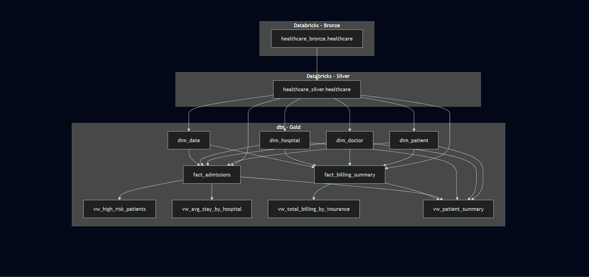

# Patient-Risk-Prediction

**Author:** Suleman Ali  
**Date:** 2025-10-28  

---

## Table of Contents
1. [Project Overview](#project-overview)
2. [Data Lineage](#data-lineage)
3. [ETL Layer-wise Explanation](#etl-layer-wise-explanation)
4. [Gold Models: Mini Data Dictionary](#gold-models-mini-data-dictionary)
5. [Next Steps (Planned)](#next-steps-planned)
6. [Note](#note)

---

## Project Overview

This project implements an end-to-end **ETL pipeline** for patient risk prediction. It uses:

- **Databricks** for Bronze and Silver layers  
- **dbt** for Gold layer (dimensions, facts, and views)  
- **Power BI** (planned) for reporting and dashboards  
- **Chatbot** (planned) for patient insights  

The goal is to provide a unified view of patient demographics, admissions, billing, and risk classification.

---

## Data Lineage

---

## ETL Layer-wise Explanation

- **Bronze Layer (Databricks):**  
  Raw healthcare data stored in the `healthcare` table.  

- **Silver Layer (Databricks):**  
  Cleaned and transformed data, stored in the `healthcare` table.  

- **Gold Layer (dbt):**  
  Dimensional and fact tables, plus views for analytics. Models include:

  - **Dimensions:** `dim_patient`, `dim_doctor`  
  - **Fact Tables:** `fact_admissions`, `fact_billing_summary`  
  - **Views:** `vw_high_risk_patients`, `vw_avg_stay_by_hospital`, `vw_total_billing_by_insurance`, `vw_patient_summary`  

---

## Gold Models: Mini Data Dictionary

| Model | Columns | Description |
|-------|---------|-------------|
| dim_patient | patient_sk, patient_name, gender, blood_type, medical_condition, insurance_provider | Stores patient demographics and insurance details. |
| dim_doctor | doctor_sk, doctor, hospital, conditions_treated, total_patients | Stores doctor and hospital details. |
| fact_admissions | admission_sk, doctor_sk, patient_sk, doctor, hospital, admission_type, total_admissions, avg_stay_duration | Captures patient admissions details. |
| fact_billing_summary | billing_sk, hospital, insurance_provider, total_billed, avg_bill, total_patients | Aggregated billing information. |
| vw_high_risk_patients | patient_sk, patient_name, gender, medical_condition, hospital, billing_amount, stay_duration_days, risk_level | View highlighting high-risk patients. |
| vw_avg_stay_by_hospital | hospital_sk, hospital, total_patients, avg_stay_days, min_stay_days, max_stay_days | Summarizes average stay by hospital. |
| vw_total_billing_by_insurance | insurance_sk, insurance_provider, total_claims, total_billing, avg_billing, max_billing | Aggregates billing by insurance provider. |
| vw_patient_summary | patient_sk, patient_name, age, gender, medical_condition, hospital, insurance_provider, medication, admission_type, date_of_admission, discharge_date, stay_duration_days, billing_amount, test_results | Unified patient summary for analytics. |

---

## Next Steps (Planned)

1. **Power BI Reports**: Visualize admissions, billing, and high-risk patients.  
2. **Predictive Models**: Machine learning to predict patient risk.  
3. **Chatbot Integration**: Provide patient insights using the data pipeline.  

---

**Note:** This README will be updated as additional ETL processes, models, and reporting components are implemented.
